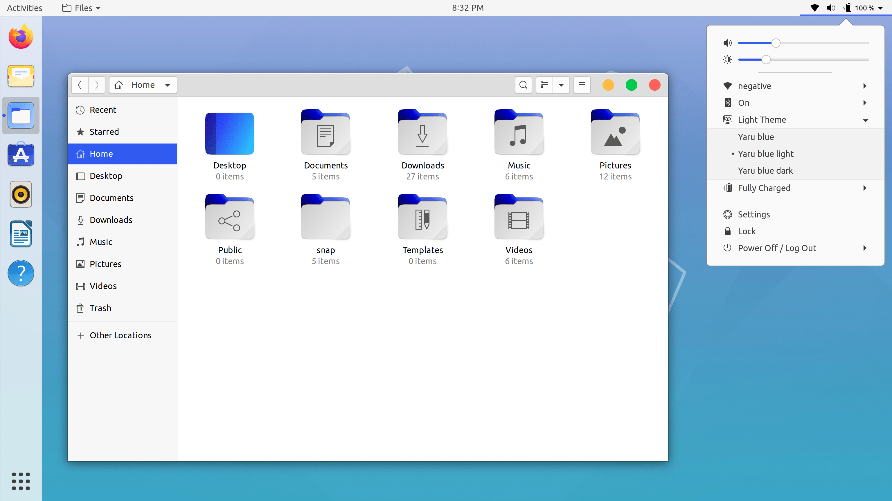
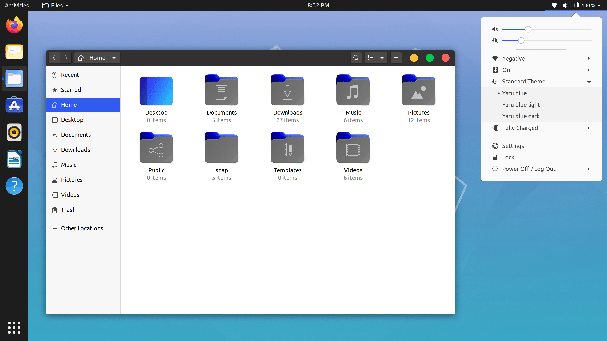
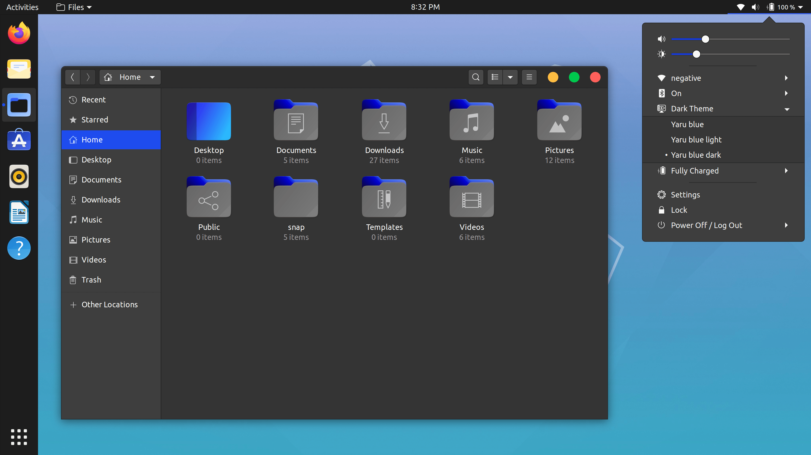

## Yaru-remix-theme-toggle

Yaru-remix-theme-toggle is a based on [Pop-toggle](https://github.com/kylecorry31/gnome-shell-extension-pop-theme-toggle)

## Functions:
- Switches from any **GTK3-theme** to [Yaru-remix](https://github.com/Muqtxdir/yaru-remix) **GTK3-themes**.
- Switches from any **Gnome-shell-theme** to [Yaru-remix](https://github.com/Muqtxdir/yaru-remix) **Gnome-shell themes**.
- Switches from any **icon-theme** to [Yaru-remix](https://github.com/Muqtxdir/yaru-remix) **icon-themes**.

## Installation:
If you would like to try this gnome-shell-extension, please follow instructions from [here](install.md).

## Screenshots:

### Extension in Menu:

### Switching to Yaru-remix-light:

### Switching to Yaru-remix-standard:

### Switching to Yaru-remix-dark:

