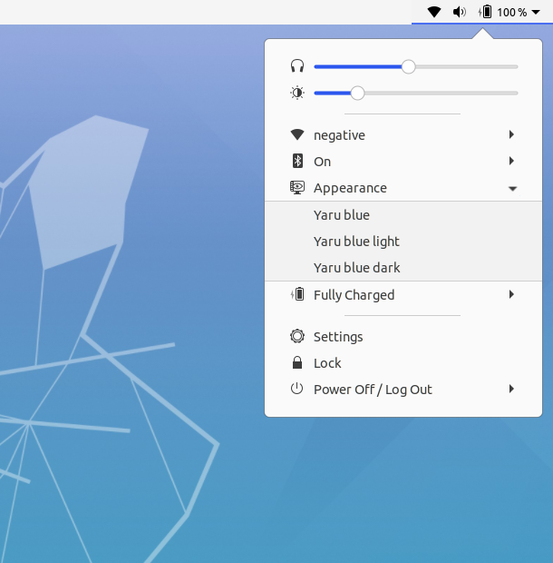

## Yaru-blue-theme-toggle

Yaru-blue-theme-toggle is a gnome-shell-extension.

## Functions:
- Switches from any **GTK3-theme** to [Yaru-blue](https://github.com/Muqtxdir/yaru-blue) **GTK3-themes**.
- Switches from any **Gnome-shell-theme** to [Yaru-blue](https://github.com/Muqtxdir/yaru-blue) **Gnome-shell themes**.
- Switches from any **icon-theme** to [Yaru-blue](https://github.com/Muqtxdir/yaru-blue) **icon-themes**.

## Installation:
If you would like to try this gnome-shell-extension, please follow instructions from [here](install.md).

## Screenshots:

### Extension in Menu:

### Switching to Yaru-blue-light:

### Switching to Yaru-blue-standard:

### Switching to Yaru-blue-dark:

