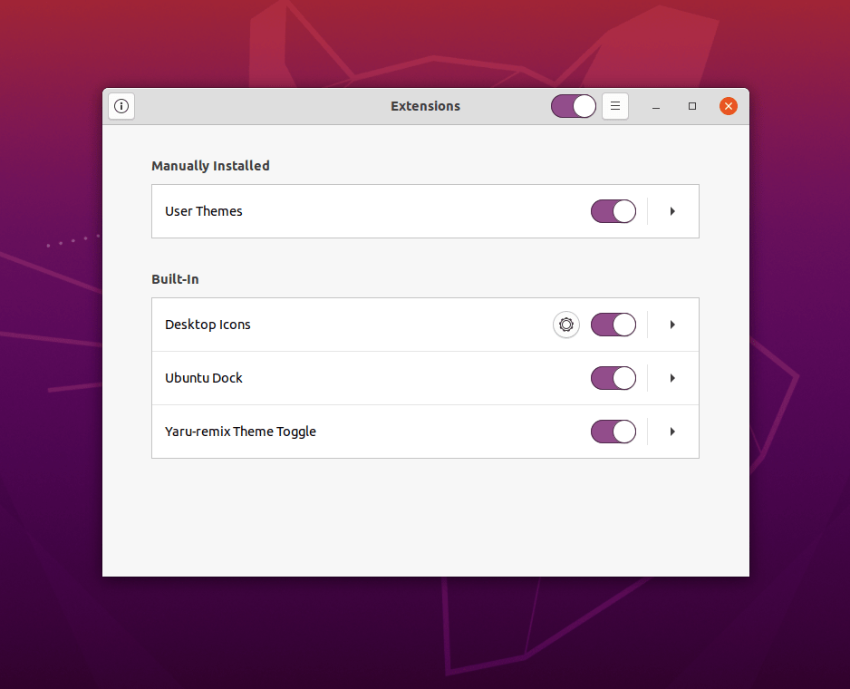

### install yaru-remix-theme-toggle:

The extension can be installed directly from source, either for the convenience of using git or to test the latest development version.

### Prerequisite:
- Install Git and Meson
```bash
  sudo apt install git meson gnome-shell-extension-prefs
```
- Install the User-themes extension from [here](https://extensions.gnome.org/extension/19/user-themes/).

- Install [Yaru-remix](https://github.com/Muqtxdir/yaru-remix) 

### Install:

- To install all yaru-remix-theme-toggle, simply run the following.

```bash
# clone this repository
git clone https://github.com/Muqtxdir/yaru-remix-theme-toggle.git
```

```bash
cd yaru-remix-theme-toggle
```

```bash
# Initialize build system (only required once per repo)
meson build

cd build

# Build and install
sudo ninja install
```

- After install, a logout  is required or shell-restart by <kbd>Alt</kbd> + <kbd>F2</kbd> and then entering <kbd>r</kbd> 

### Enable yaru-remix-theme-toggle

- The extension can now be enabled from **Extensions**  (*can also be done in Gnome-tweaks or dconf*)




- yaru-remix-theme-toggle can now be accessed from **_System-Menu_**


- Enjoy!


### Uninstall:

- To uninstall all yaru-remix-theme-toggle, simply run the following.

```bash
 cd yaru-remix-theme-toggle

 cd build

 sudo ninja uninstall
```
- After uninstall, a logout is required shell-restart by <kbd>Alt</kbd> + <kbd>F2</kbd> and then entering <kbd>r</kbd> 


*Note: yaru-remix-theme-toggle is installed if you choosed Script-install(simple-installation) from [Yaru-remix](https://github.com/Muqtxdir/yaru-remix)*
